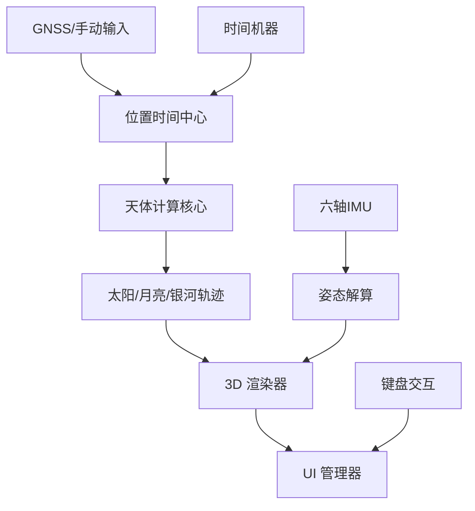

# 太阳位置分析工具（Sky Compass）

## 项目概述

SkyCompass（天空罗盘） 是一个运行在 M5Stack CardputerADV 上的天体导航应用，通过Cap LoRa-1262模块中的GNSS获取定位（没有GNSS亦可以设置离线经纬度），用于可视化太阳、月亮和银河在天空中的运行轨迹、天文潮汐计算。支持六轴传感器控制观察视角。 

## 硬件条件

- M5 Cardputer ADV（ESP32）
- 六轴IMU（加速度计 + 陀螺仪）
- 内置GNSS模块
- 键盘 + 小尺寸屏幕

## 项目目标

- **全天体可视化**：实时计算并渲染太阳、月亮、银河中心在天空中的方位角和高度角轨迹。
- **高精度定位支持**：通过 GNSS 自动获取位置或手动设置离线经纬度/时区。
- **3D 沉浸式观察**：利用六轴 IMU 实现“所见即所得”的 3D 观察视角映射。
- **时间预测（时间机器）**：支持预测未来或查阅历史任意时间点的天体运行状态。
- **天文潮汐计算**：基于物理模型计算由于日月引力引起的天文潮汐变化趋势。
- **完全离线运行**：所有天文算法、地理数据处理均在本地完成，无网络依赖。

## 约束与原则

- **本地化**：所有功能需在 ESP32 本地完成，不依赖外部 API。
- **模块化**：采用 HAL -> Core -> App 的清晰分层架构，易于扩展硬件或算法。
- **工程精度**：计算精度以工程摄影、户外导航为目标。
- **自适应设计**：界面适配 Cardputer 的小屏幕和键盘操作习惯。

## 架构设计

### 模块划分

1. **硬件抽象层（HAL）**
   - `hal_gnss` - GNSS 模块接口（支持 Cap LoRa-1262）
   - `hal_imu` - 六轴运动传感器接口
   - `hal_display` - 屏幕驱动与基础图形封装
   - `hal_keyboard` - 全键盘事件处理

2. **核心逻辑层（Core）**
   - `celestial_core` - 多天体计算统一调度框架
   - `sun_calculator / moon_calculator` - 日月天文坐标算法
   - `sky_hemisphere` - 天球半球几何模型
   - `view_3d_renderer` - 3D 坐标投影与 3D 场景渲染系统
   - `attitude_estimator` - 四元数姿态解算与视角同步
   - `position_manager` - 时间、地理坐标与时区综合管理
   - `ui_manager` - 界面状态机与多页面渲染

3. **应用逻辑层（App）**
   - `app_main` - 主应用流程控制与模块协调
   - `time_machine` - 时间回溯与快进逻辑
   - `user_input` - 基于键盘的全局交互映射

### 数据流



## MVP阶段功能列表

### 已实现的功能

1. ✅ GNSS定位（经纬度、UTC时间）
2. ✅ 太阳、月亮、银河轨道计算
5. ✅ IMU姿态解算
6. ✅ 天文潮汐计算
8. ✅ 时间机器功能（日期/时间切换）
9. ✅ 设置离线经纬度


## 开发环境

- PlatformIO
- ESP32 开发框架
- M5Stack 库

## 安装与使用

1. 克隆本仓库
2. 在PlatformIO中打开项目
3. 安装必要的库（M5Stack、TinyGPS++等）
4. 编译并上传到M5 Cardputer ADV
5. 开机后等待GNSS定位成功
6. 使用键盘导航和调整设置

## 硬件限制说明

- **航向漂移**：由于缺少磁力计，仅使用IMU进行姿态解算会导致航向随时间漂移。建议定期校准或使用GNSS运动数据辅助修正。
- **定位精度**：GNSS模块在室内或遮挡严重的环境下可能无法定位或精度下降。


## 代码结构

```
SkyCompass/
├── README.md
├── platformio.ini         # PlatformIO 配置文件
├── SkyCompass.ino         # Arduino IDE 兼容入口
├── src/
│   ├── main.cpp           # PlatformIO 主入口
│   ├── hal/               # 硬件抽象层
│   │   ├── hal_gnss.h/cpp
│   │   ├── hal_imu.h/cpp
│   │   ├── hal_display.h/cpp
│   │   └── hal_keyboard.h/cpp
│   ├── core/              # 核心逻辑与算法
│   │   ├── celestial_core        # 天体计算框架
│   │   ├── sun_calculator        # 太阳算法
│   │   ├── moon_calculator       # 月亮算法
│   │   ├── sky_hemisphere        # 天球模型
│   │   ├── view_3d_renderer      # 3D 渲染引擎
│   │   ├── attitude_estimator    # 姿态解算
│   │   ├── position_manager      # 位置/时间管理
│   │   ├── ui_manager            # UI 逻辑
│   │   └── log_manager.h         # 日志管理
│   └── app/               # 应用层
│       ├── app_main.h/cpp
│       ├── time_machine.h/cpp
│       └── user_input.h/cpp
└── lib/                   # 依赖库
```

## 计算精度

- **天体位置**：基于 NOAA 与标准天文算法，精度满足摄影与常规户外导航。
- **姿态解算**：使用互补滤波/融合算法，在没有磁力计的情况下通过运动补偿减少漂移。
- **潮汐模型**：基于日月引力势能的理论潮汐，仅体现天文大潮/小潮趋势，不包含地形导致的局部效应。
- **时间同步**：GNSS 授时精度优于 100ns（受限于串口通信延迟，系统时钟同步在毫秒级）。

## 未来扩展

- **更多天体**：支持行星（火星、木星等）轨迹计算。